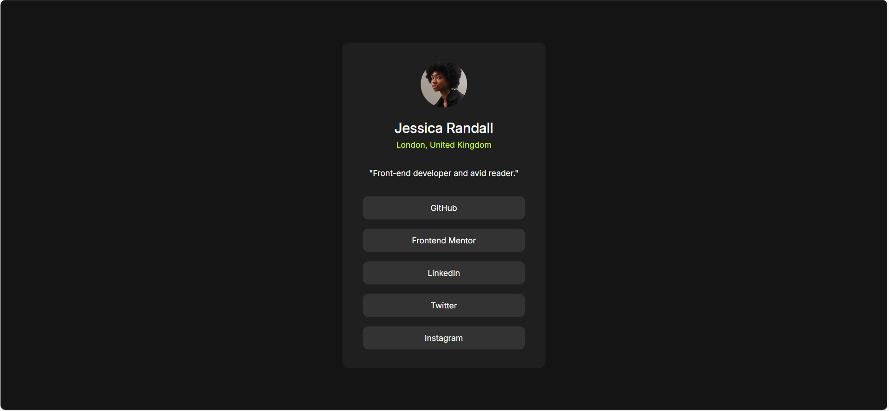

# Frontend Mentor - Social links profile solution

This is a solution to the [Social links profile challenge on Frontend Mentor](https://www.frontendmentor.io/challenges/social-links-profile-UG32l9m6dQ).

## Overview

### Screenshot

### Links

- [Solution URL](https://github.com/Gehad28/social-links-profile)
- [Live Site URL](https://gehad28.github.io/social-links-profile)

## My process

### Built with

- Semantic HTML5 markup
- CSS custom properties

## Author

- Website - [Gehad Ahmad](https://github.com/Gehad28)
- Frontend Mentor - [@Gehad28](https://www.frontendmentor.io/profile/Gehad28)

